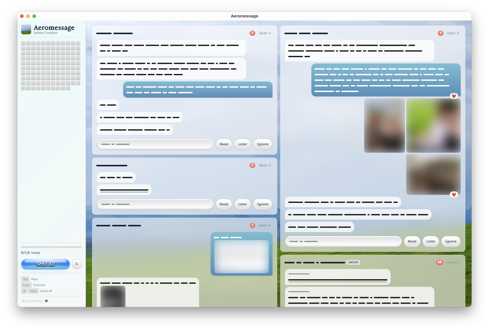

# Aeromessage



Batch-reply to iMessages. Draft replies, commit them, send all at once.

## Features

- Grid view of all unread conversations
- Draft and commit replies before sending
- Later / Ignore / Mark as Read to triage
- Privacy mode to blur content
- Send All when ready

## Install

```sh
nix run
```

Or without Nix:

```sh
cd oxidized
./build.sh
```

The DMG will be at `oxidized/out/Aeromessage.dmg`.

On first launch, grant **Full Disk Access** in System Settings to read your messages.

## Development

```sh
cd oxidized
npx @tauri-apps/cli dev
```

Or with Nix:

```sh
nix develop
cd oxidized
cargo tauri dev
```

## License

CC0 1.0 Universal - Public Domain
